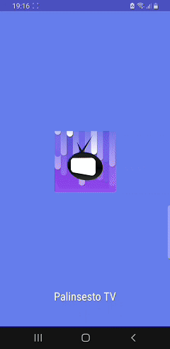

# Palinsesto TV

A modern Progressive Web App (PWA) that displays Italian TV program schedules in real-time with a beautiful, responsive interface.

## Introduction

Palinsesto TV is a Flask-based web application that scrapes and displays TV program schedules for major Italian channels including Rai 1, Rai 2, Rai 3, Rete 4, Canale 5, Italia 1, and LA7. The app features a modern glassmorphism design with full PWA capabilities for offline access and mobile installation.

## Description

The app shows real-time TV schedules for 7 major Italian channels with a modern glassmorphism design that works on all devices. As a PWA, it supports offline use and mobile installation. It’s fully localized in Italian and highlights the current program. Built with Flask backend and HTML/CSS/JS frontend, it uses web scraping to get data and includes custom styling with Bootstrap Icons.

## Getting Started

 **Build and run with Docker**

   ```bash
   docker build -t palinsestotv .
   docker run -p 8080:8080 palinsestotv
   # navigate http://localhost:8080
   ```

## User Flow
<div align="left">
<table>
  <tr>
    <td></td>
  </tr>
</table>
</div>
